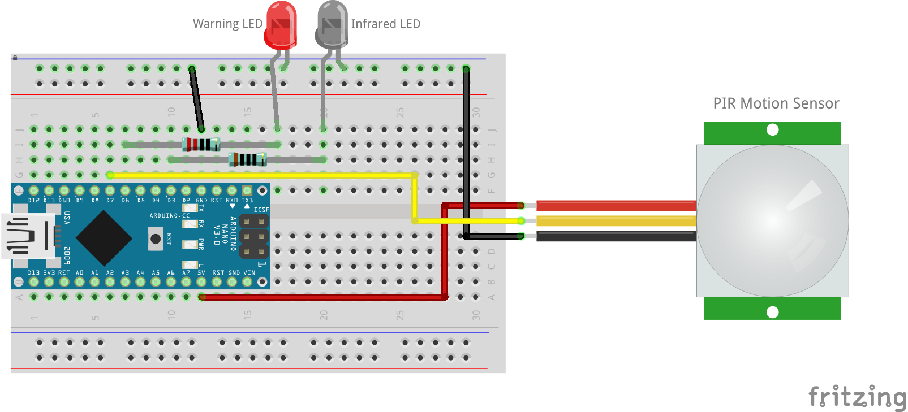

# turnOffTheTV
Turns the TV off if no motion is detected using an Arduino Nano, a PIR Sensor, and an Infrared LED.

If you’ve got kids, you’re probably used to the TV playing to an empty room. They’ll turn it on, watch their show, and then just go and play with something else. This device turns the TV off after no motion has been detected for x minutes.

The PIR sensor detects movement in the room. If nothing is detected for 4 minutes, the Warning LED flashes for 1 minute… and if there’s still no movement, the Infrared Transmitter sends a TV OFF signal, as if someone had pressed the OFF button on the remote.

To stop it turning the TV back on again and going into an ON/OFF loop, the device is powered from the USB port on the back of the TV – which means when the TV is off, so is the device.

Uses this library: https://github.com/z3t0/Arduino-IRremote

